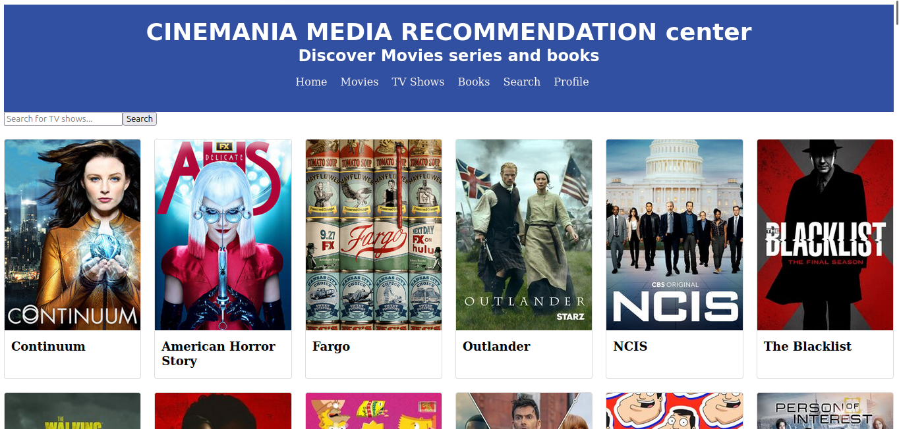
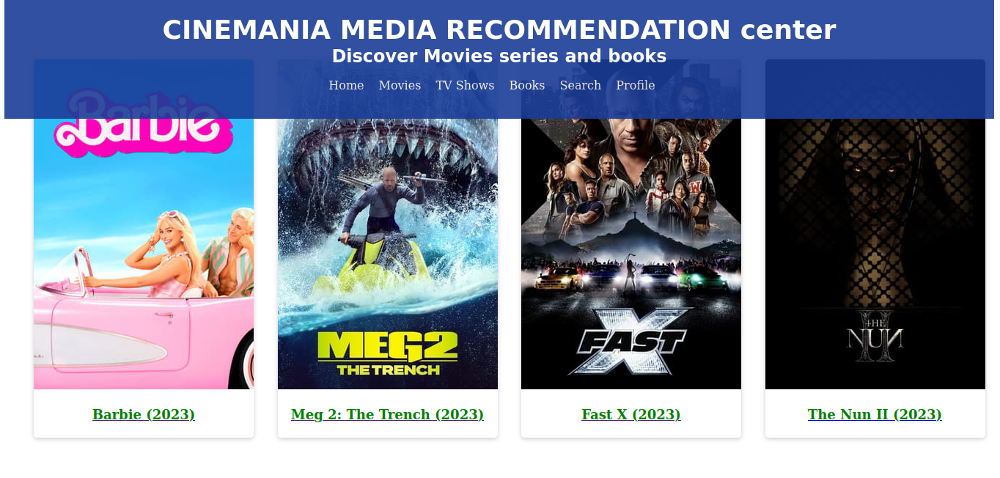
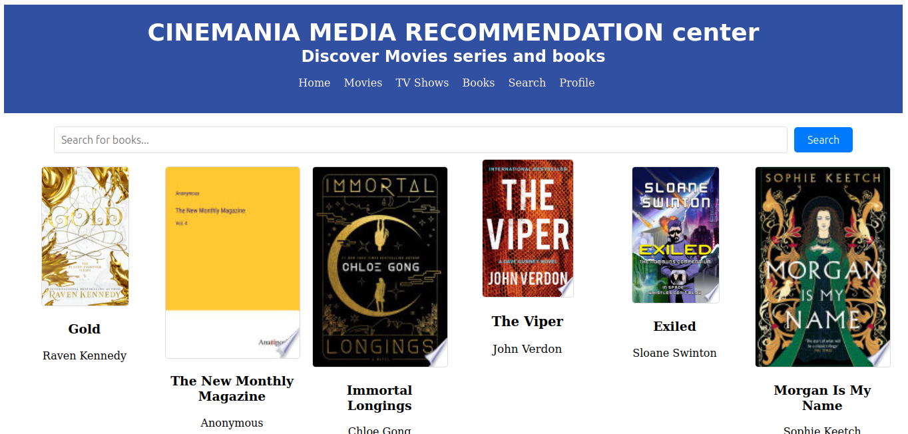

# Cinemania Frontend

This project was generated with [Angular CLI](https://github.com/angular/angular-cli) version 15.2.2.
It is the frontend portion to my django cinemania app, it allows users to search for movies, tv and books through apis which allows for live reloading and getting the latest videos.
the styling is not yet complete as i was still focused on functionality

I used TMDB api for movies, TVMaze for series and Open library api for books. The website does not however allow you to watch movies or shows as those are copyrighted

## views

### tv view
this is what the user sees at the moment when they view the tv shows

### movies

### books

### landing page

## Development server

Run `ng serve` for a dev server. Navigate to `http://localhost:4200/`. The application will automatically reload if you change any of the source files.

## Code scaffolding

Run `ng generate component component-name` to generate a new component. You can also use `ng generate directive|pipe|service|class|guard|interface|enum|module`.

## Build

Run `ng build` to build the project. The build artifacts will be stored in the `dist/` directory.

## Running unit tests

Run `ng test` to execute the unit tests via [Karma](https://karma-runner.github.io).

## Running end-to-end tests

Run `ng e2e` to execute the end-to-end tests via a platform of your choice. To use this command, you need to first add a package that implements end-to-end testing capabilities.

## Further help

To get more help on the Angular CLI use `ng help` or go check out the [Angular CLI Overview and Command Reference](https://angular.io/cli) page.

## Authors
-shadrack odielo
##licensing
-MIT
## Can I contribute
This site is a work in progress and therefore anyone can submit a pull request to make changes to the site. i will continue to add functionality as time goes by.

